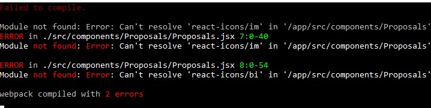
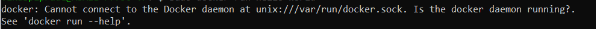
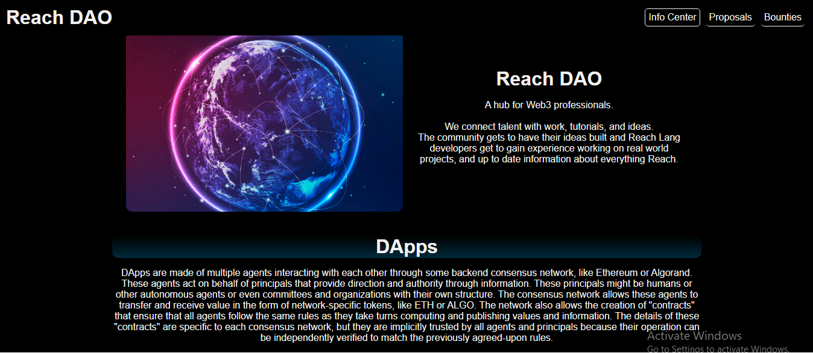
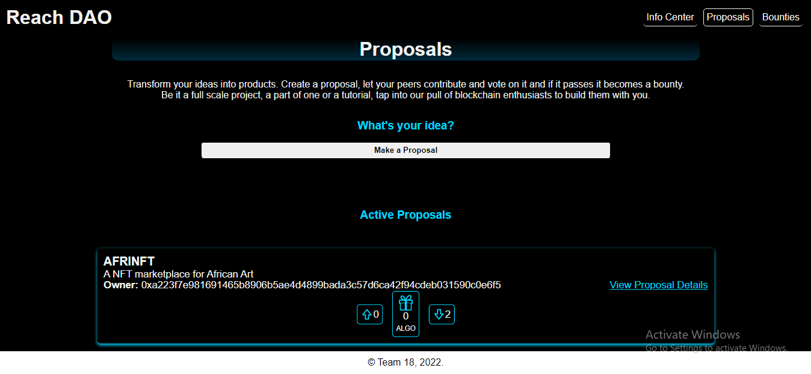
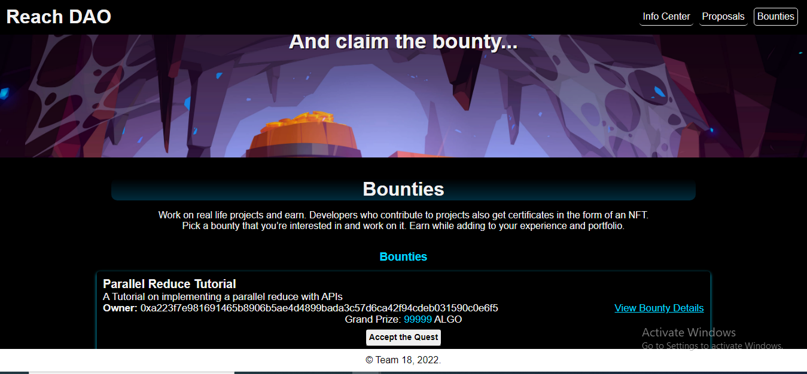

# Reach DAO

This project was created for the decentralized Umoja3 Bounty hack, organized by [Reach](bit.ly/3GJm5ep), the African Blockchain Alliance and Algorand.

The DApp allows any user to create a proposal for other users to contribute to and vote on. If the proposal passes, it becomes a bounty funded by the contributions as well as funds raised from sponsors. If the proposal does not pass, all users who contributed can claim a refund on the amounts that each of them contributed.  

We envision that a proposal could be a fullscale DApp, A part of a DApp, A tutorial, or frameworks or tools that make building with Reach easier and faster for developers. We do not limit proposals to this and look forward to creative ways users use our DApp.
The central idea behind the Reach DAO is to allow projects to be executed or actualized faster by incentivising them via bounties while also providing an avenue for Reach Developers to gain much needed experience and expertise and earn money while doing this.  

The end game is for the Reach DAO to be a hub for Reach developers with the benefit of the Reach community in mind, and we hope that users create proposals with this in mind.
Those who are not developers but have projects that they may want to execute are also invited to create proposals.

## Getting Started

### Pre-requisites and Local Development

Developers using this DApp should already have Reach, Docker and Node installed on their local machines.

#### The guidelines for installation can be found below

- [Instructions for installing Reach and Docker](https://docs.reach.sh/quickstart/#qs-win-install)
- [Instructions for installing Node](https://nodejs.org/en/download/)  

In addition, they should have an Algorand wallet (preferably Pera Algo Wallet) installed on their phone and loaded with Testnet Algos in order to be able to sign transactions and contribute to proposals. The wallet can be installed from the App store (i-Phone) or Google Play (Android) as is appropiate.

You can some testnet Algos from the [Algo Faucet](https://bank.testnet.algorand.network/).

### Running the DApp

We recommend running the DApp using Ubuntu20.04 terminal.

#### Steps

1. Fork the Repository.

2. Clone the Repository.

3. Change Directory (cd) into the directory.

4. Run the following commands to start up the app:  

```sh
npm install
```

```sh
./reach react
```

## Usage

Please be aware that you would have to sign multiple transactions on your mobile device while going through most of the steps below.

1. Open a few tabs in your favourite browser (we recommend at least 3 tabs).

2. Navigate to the app at the URL <http://localhost:3000>.  

3. Click on the Connect Wallet button to activate wallet connect and scan the QR code.  

4. Click on the Deploy button to deploy the contract as an Admin in the first tab.

5. Copy the contract information to the clipboard by clicking on the Copy to Clipboard button and then head on over to the next tab and follow steps 1 - 3 after which you can attach to the contract as a new user by clicking on Attach and pasting the contract information and clicking on the the button to attach.

6. You would be greeted by the Welcome page.

7. Please navigate to the Proposals page by clicking on the Proposals button on the top right-hand side of your screen. You can then go ahead to create a proposal by clicking on the Make a Proposal button and  filling out all the fields of the form after which the proposal would be added to the list of active proposals.

8. After creating a proposal, you can go to the next tab and attach as a seperate user following the processes described in steps above and navigate to the proposals page. You would see a list of active proposals and can go ahead to upvote, downvote or contribute to any proposal that you choose to.  

A user may upvote, downvote or contribute to a proposal before the proposal deadline which starts counting as soon as the proposal is created, This is currently set to 50 blocks on Algorand, 5 blocks on ETH and 500 blocks on Conflux. You may change these values if you choose by changing the values on line 301 of the ReachContext.js file in your code editor by following the path [/src/context/ReachContext.js](src/context/ReachContext.js).  

If a proposal passes i.e it has more upvotes than downvotes after the deadline elapses, the proposal is moved to the list of active bounties which can be found on the bounties page. If the proposal fails then any user who contributed can claim a refund by clicking on the claim refund button which becomes visible when a proposal fails.  

We encourage you to play around with the DApp and create as many proposala as you want to and upvote, downvote and contribute to them.  

## Troubleshooting

### Module not found: can't reslove 'react-icons/im'

If you get the error below:



Please run the following commands:  

```sh
npm install react-icons
```

```sh
./reach react
```

### docker: Cannot connect to the Docker daemon at unix:///var/run/docker.sock. Is the docker daemon running?

If you get the error below:



Please run the following commands:  

```sh
sudo service docker stop
```

```sh
sudo service docker start
```

```sh
./reach react
```

Should you encounter any other errors, please tag either `goonerlabs#1008` 0r `Emmanuel Agbavwe#2954` in the help channel of the [Reach Discord Server](bit.ly/3BnPyKd).  

And the rest of the awesome team at Reach, The African Blockchain Alliance and The Algorand Foundation.

## The DApp

### The Landing page



### The Proposals Page



### The Bounties Page



## Authors

- Owolabi Adeyemi
- Emmanuel Agbavwe

## Acknowledgements  

- [JP Miller](https://github.com/TheChronicMonster)
- [Nick Stanford](https://github.com/nstanford5)
- Melvin Wafula  

## Contributing

This project is open to contributions from great minded developers who share our goal to make development easier, and to bring more developers into Web3 through the [Reach Lang](https://github.com/Aro1914/Reach-Lang) and by building on the Algorand network.  

To contribute, simply:

- Fork this repo, make your updates and additions
- Create a GitHub discussion and bring your new ideas to our notice.
- Once approved, set up a pull request.
- After revision, your name will forever be among the wonderful develpers who contributed to building Reach DAO.  
